# Data Analysis

This folder contains the Jupyter notebooks used to analyze the datasets created during the Data Preparation stage.  
The analyses focus on dataset statistics, amino acid distributions, and visualizations used to assess data quality and composition before model training.

---

## Overview

The purpose of this stage is to:
- Perform exploratory data analysis (EDA) on both positive and negative protein datasets.  
- Visualize sequence properties such as length distributions and amino acid composition.  
- Generate visual summaries (plots and matrices) to identify biases or trends useful for model interpretation.

---

## Notebooks

### matrices.ipynb
This notebook computes and visualizes **frequency and weight matrices** for signal peptide sequences.

**Content summary:**
- Reads prepared training subsets.
- Calculates amino acid occurrence and position-specific frequencies.
- Generates visual matrices showing the positional preference of residues.

[Open matrices.ipynb](./matrices.ipynb)

---

### plots.ipynb
Notebook dedicated to creating **summary visualizations** from the processed datasets.

**Main plots generated:**
- Distribution of positive vs negative sequences per subset.
- Comparative amino acid frequency charts.
- Heatmaps of feature correlations or composition patterns.

[Open plots.ipynb](./plots.ipynb)

---

### length_distribution.ipynb
Analyzes and plots the **length distribution** of protein sequences in both positive and negative datasets.

**Key steps:**
- Reads all enriched `.tsv` subsets.
- Computes sequence length for each entry.
- Creates histograms and boxplots comparing class distributions.
- Identifies outliers or imbalanced length profiles.

[Open length_distribution.ipynb](./length_distribution.ipynb)

---

## Workflow Summary

1. Load enriched datasets produced in the [Data Preparation](../Data%20Preparation/README.md) phase.  
2. Compute general and position-specific statistics.  
3. Generate matrices, plots, and histograms summarizing dataset characteristics.  
4. Export visualization outputs for interpretation 

---

---

## Notes

- All notebooks are designed for reproducible execution in Jupyter environments.  
- Ensure that enriched `.tsv` files and related subsets from Data Preparation are available before running the analyses.  
- Outputs (figures and computed matrices) are stored automatically in local directories specified within each notebook.

## 📊 Visual Outputs

### Species and Kingdom Occurrence

  <a href="./Species_occurrence_in_training_set_pie.png">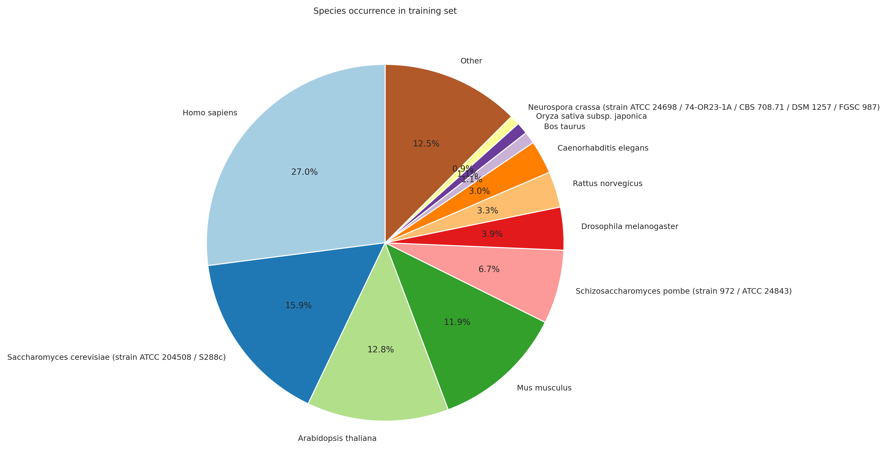</a>
  <a href="./Kingdom_occurrence_in_training_set_pie.png">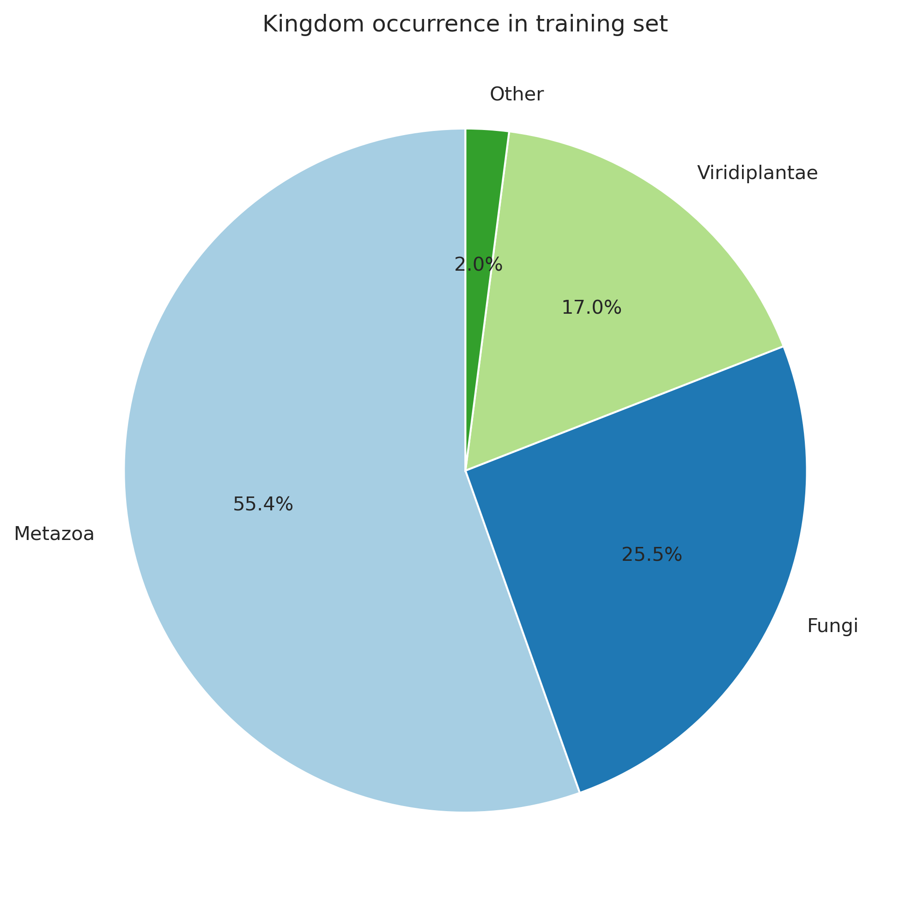</a>

  <a href="./Species_occurrence_in_benchmark_set_pie.png">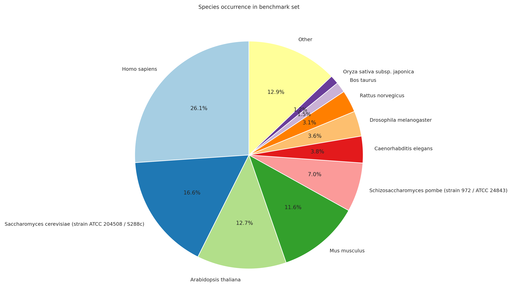</a>
  <a href="./Kingdom_occurrence_in_benchmark_set_pie.png">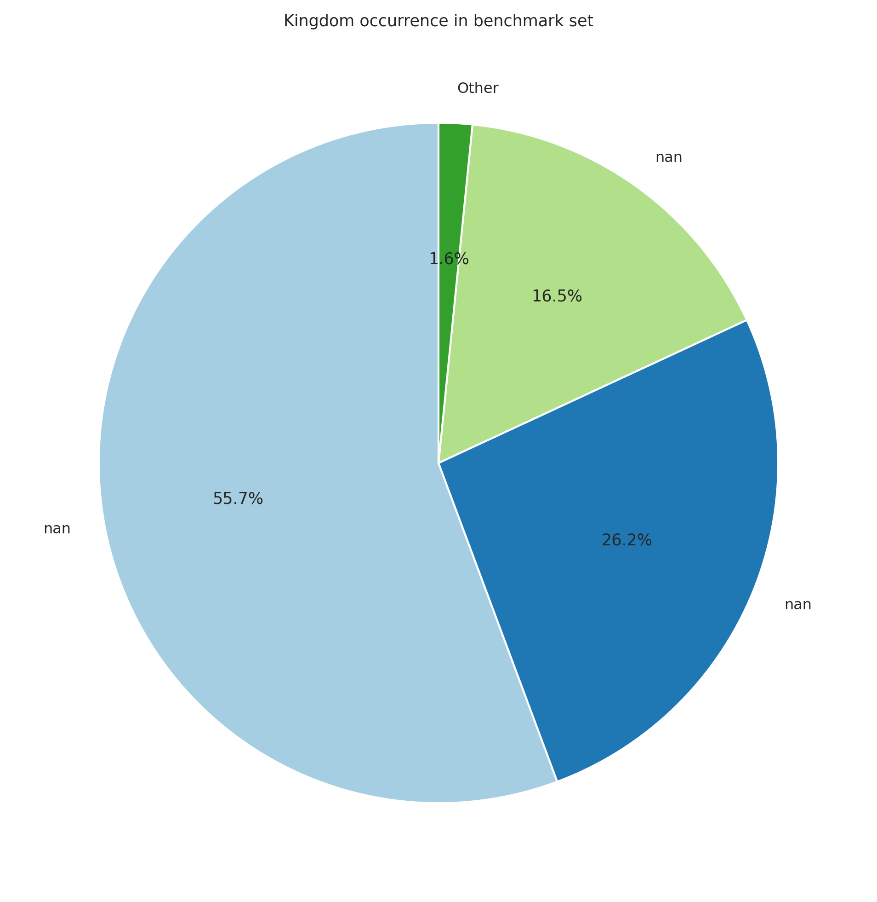</a>

---

### Sequence Length Distributions

  <a href="./sequence_length_training_hist.png">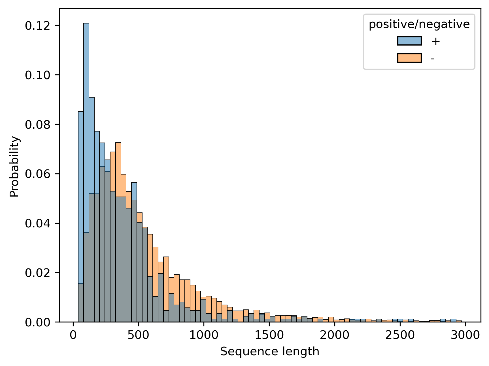</a>
  <a href="./sequence_length_benchmark_hist.png">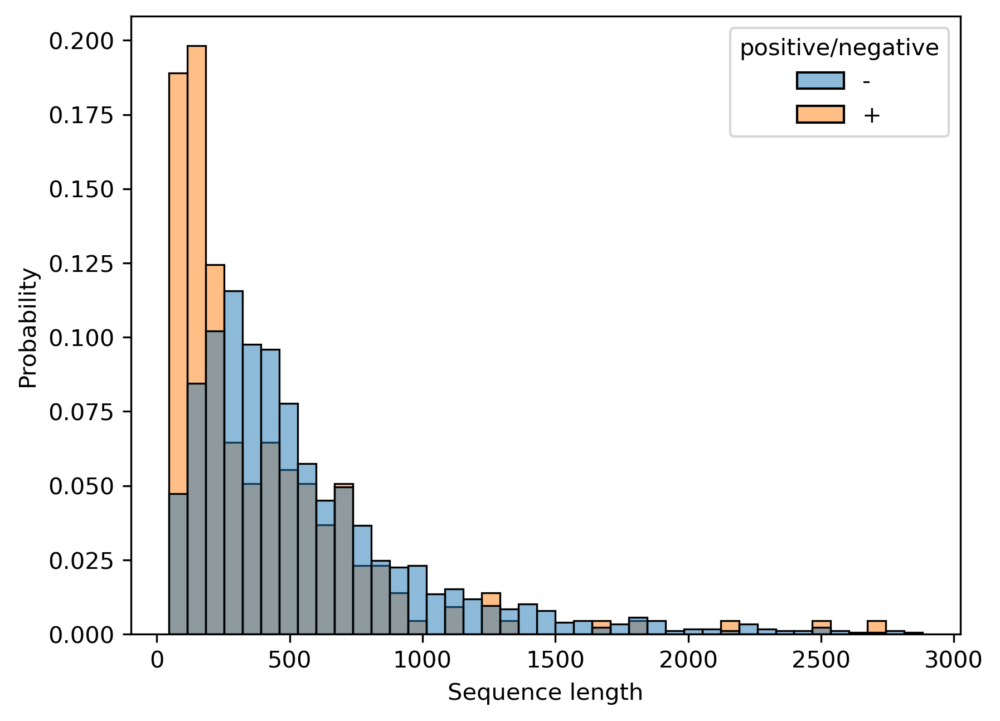</a>

  <a href="./sequence_length_total_hist.png">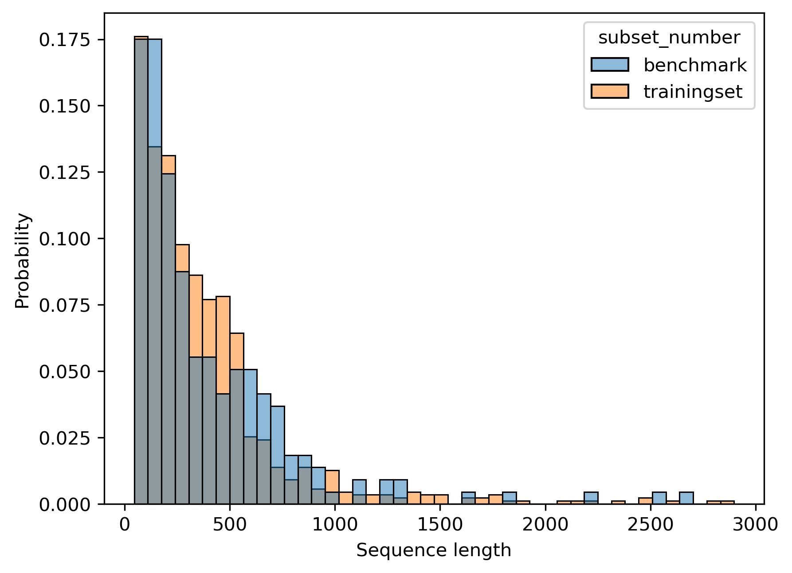</a>
  <a href="./sequence_length_training_k.png">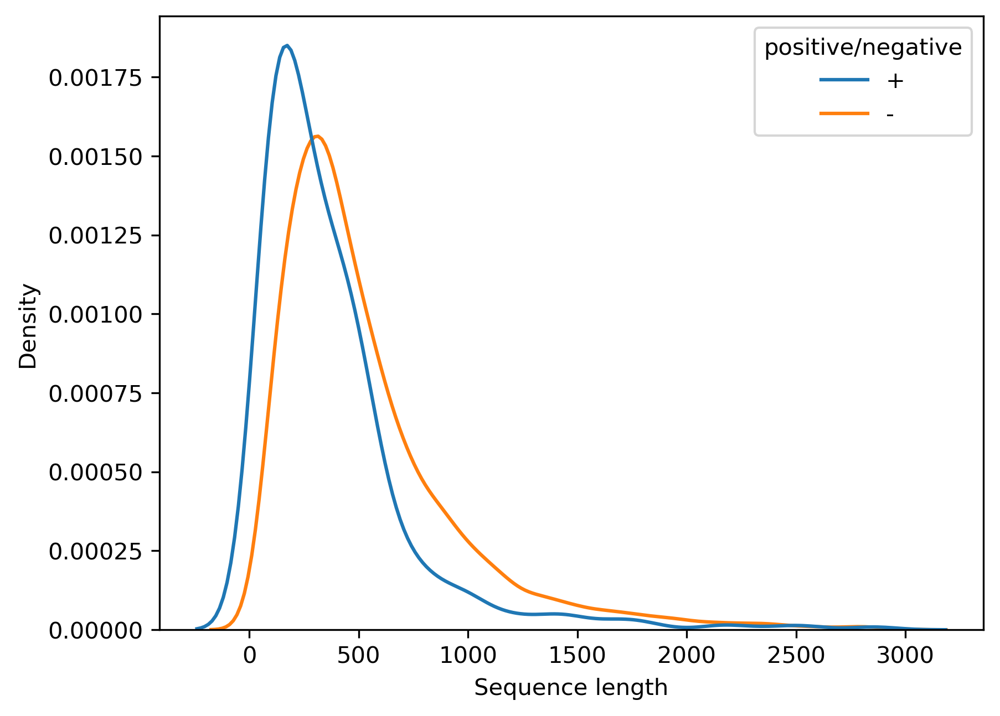</a>

  <a href="./sequence_length_benchmark_k.png">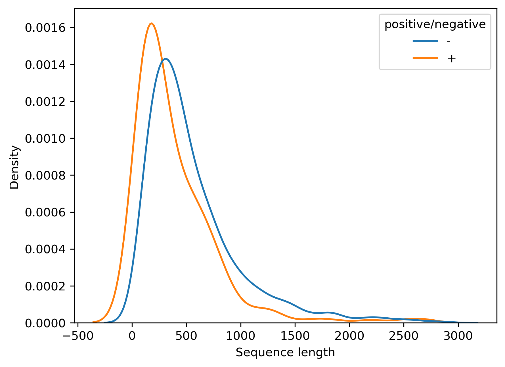</a>
  <a href="./sequence_length_total_k.png">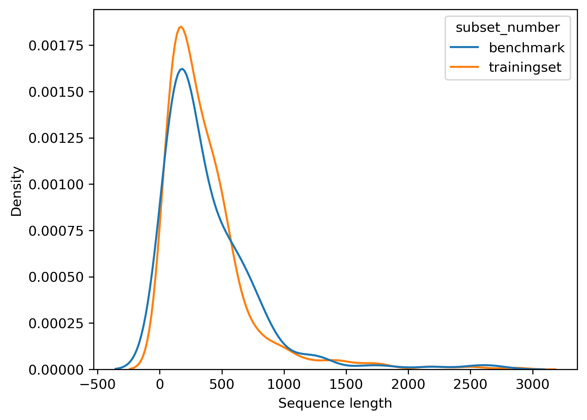</a>

---

### Residue Frequency Analysis

  <a href="./residue_frequency_training.png">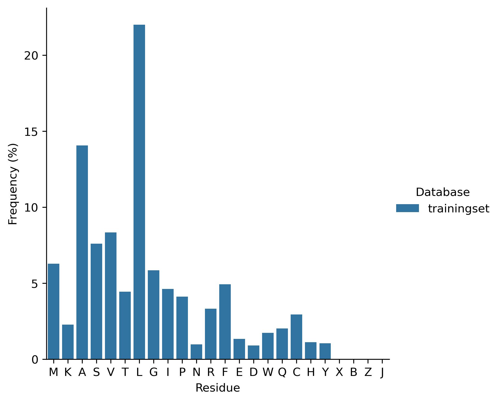</a>
  <a href="./residue_frequency_benchmark.png">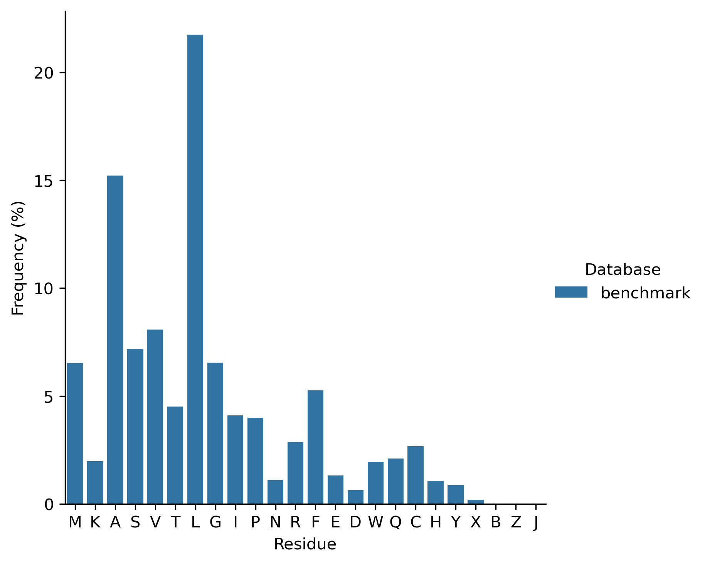</a>

  <a href="./residue_frequency_total.png">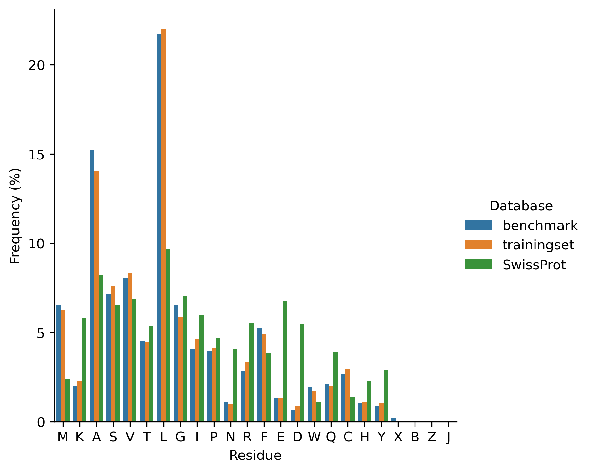</a>

---

### Benchmark Overview

  

