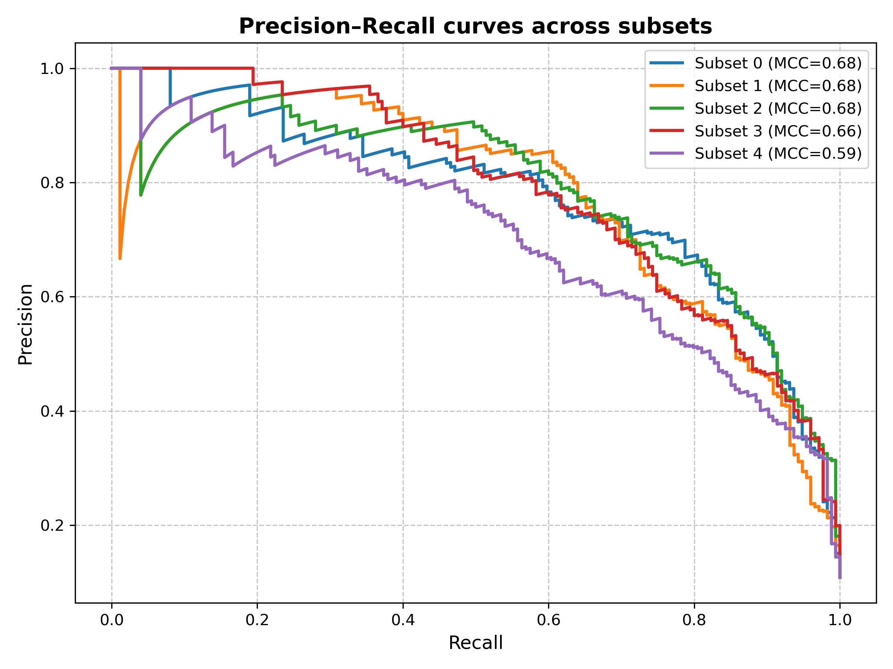
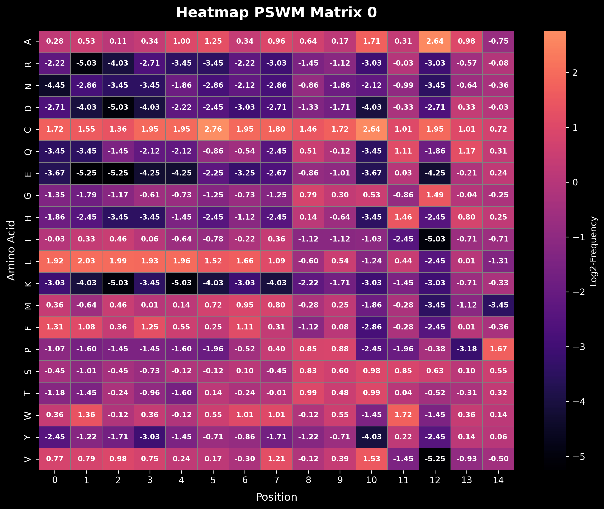

# von Heijne – PSWM cross-validation

This folder contains the notebook that implements a von Heijne–style, PSWM-based signal peptide scoring pipeline with 5-fold cross-validation.

## Contents

- [cross_validation.ipynb](./cross_validation.ipynb)

## What the notebook does

1. **Loads enriched subsets**  
   Expects the five TSV files:
   - `subset1_arricchito.tsv`
   - `subset2_arricchito.tsv`
   - `subset3_arricchito.tsv`
   - `subset4_arricchito.tsv`
   - `subset5_arricchito.tsv`

2. **Builds a Position-Specific Weight Matrix (PSWM)**  
   - Initializes a matrix for amino acids across the window length.
   - Computes a PSWM from positive sequences in the training split.

3. **Sliding-window scoring on validation/test**  
   - For each sequence, scans all windows and keeps the **max score**.

4. **Threshold selection on validation**  
   - Computes the precision–recall curve from the max scores.
   - Selects the **optimal threshold** by maximizing F1.

5. **Evaluation and plots**  
   - Applies the threshold to test scores → predictions.
   - Saves figures under `./Plots/`:
     - `heatmap_pswm_matrix_{i}_dark.png` – PSWM heatmap for fold *i* (dark palette).
     - `pr_curve_subset_{i}.png` – Precision–Recall curve with the chosen threshold highlighted.
     - `all_pr_curves.png` – Overlay of PR curves across folds.

> Note: the notebook produces many plots; not all images might be committed to version control.

## How to run

Open and run the notebook top-to-bottom (Jupyter / VS Code). Make sure the five `subset*_arricchito.tsv` files are available in the working directory.

## Python dependencies (from the code)

- `pandas`, `numpy`
- `matplotlib`, `seaborn`
- `scikit-learn` (for precision–recall)

## Example heatmap from matrix 0

!

